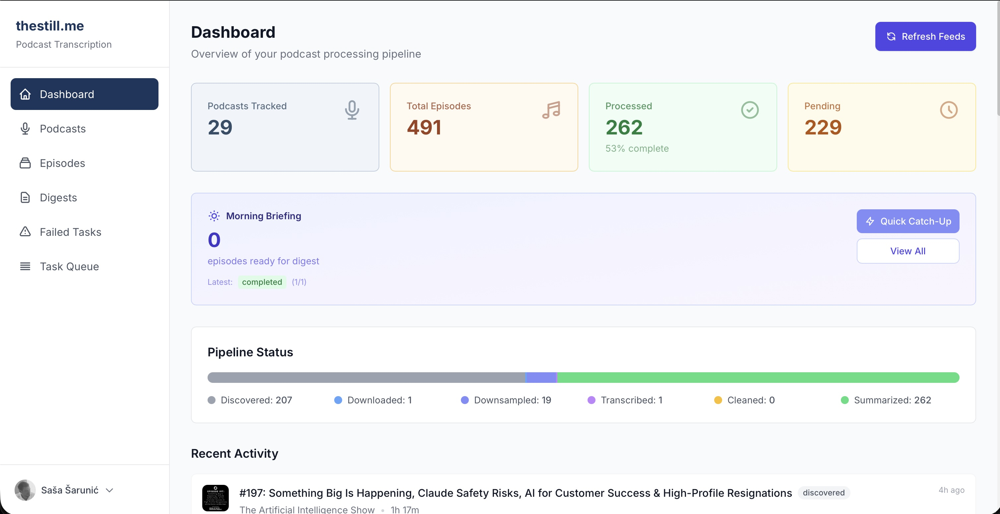

# thestill

Turn podcasts into readable content. Automatically.

## The Problem

You subscribe to 20 podcasts. Each episode is 60-90 minutes. That's 30+ hours of content per week. You'll never catch up by listening.

## The Solution

thestill downloads your podcasts, transcribes them with speaker identification, cleans up the messy speech-to-text output, and generates summaries. You get a morning briefing of everything that dropped overnight.

```bash
# Add some podcasts
thestill add "https://lexfridman.com/feed/podcast/"
thestill add "https://www.youtube.com/@hubermanlab"

# Run the web UI — episodes process continuously and your
# morning briefing is generated from your inbox
thestill server
```

That's it. New episodes are discovered, downloaded, transcribed, cleaned, and summarized. You read instead of listen.

Even better - talk to your podcasts through Claude Desktop:

- *"Generate 3 LinkedIn posts from the latest Lenny's Podcast episode"*
- *"What themes keep coming up in the last 10 Prof G episodes?"*
- *"Find every mention of 'product-market fit' across all my podcasts"*

Your podcasts become a searchable, queryable knowledge base.



## How It Works

**Six atomic steps, mix and match as you like:**

```
Discover → Download → Downsample → Transcribe → Clean → Summarize
```

Each step is independent. Failed at transcription? Fix it and continue - no need to re-download. Want cloud transcription but local LLM? Go for it.

**Transcription** - Pick your engine:

- Whisper (local, free, private)
- Parakeet (local, NVIDIA NeMo TDT)
- Google Cloud Speech-to-Text (fast, accurate)
- ElevenLabs Scribe (great quality)
- Dalston (self-hosted)

**LLM Processing** - Pick your brain:

- OpenAI GPT
- Anthropic Claude
- Google Gemini
- Mistral
- Ollama (local, free)

**Sources** - Works with:

- RSS feeds
- Apple Podcasts
- YouTube channels & playlists

## Quick Start

```bash
# Install (uv, recommended — uses the committed lockfile)
git clone https://github.com/ssarunic/thestill.git
cd thestill
uv sync --frozen

# ...or with pip
pip install -e .

# Configure (edit .env with your API keys)
cp .env.example .env

# Add a podcast and start the server (pipeline + briefings)
thestill add "https://example.com/podcast/rss"
thestill server
```

## Features

- **Web UI** - React dashboard for managing podcasts, viewing transcripts, monitoring queue
- **Speaker Diarization** - Know who said what in multi-person conversations
- **Morning Briefing** - Per-user briefing of new inbox episodes, on your schedule
- **MCP Server** - Natural language access to your podcast library via Claude Desktop
- **Multi-user Auth** - Google OAuth for hosted deployments
- **Failure Handling** - Automatic retries, dead letter queue for manual review

## Documentation

| Guide | Description |
|-------|-------------|
| [Configuration](docs/configuration.md) | Environment variables and settings |
| [Transcription Providers](docs/transcription-providers.md) | Setup guides for each provider |
| [Web Server](docs/web-server.md) | API endpoints and webhooks |
| [MCP Usage](docs/mcp-usage.md) | Claude Desktop integration |
| [Transcript Cleaning](docs/transcript-cleaning.md) | LLM-based cleanup options |
| [Logging](docs/logging-configuration.md) | Structured logging setup |
| [Docker](docs/docker.md) | Container deployment (slim/full images, compose) |
| [Storage Backends](docs/storage-backends.md) | Local disk or S3 for pipeline artefacts |
| [Security](docs/security.md) | Supply-chain and secret-scanning posture |
| [Narration](docs/narration.md) | Text-to-speech briefing narration |
| [Imports](docs/imports.md) | Importing episodes from URLs and audio files |
| [Evals](docs/evals.md) | LLM-as-judge quality evaluation runs |

## CLI Reference

```bash
# Podcast management
thestill add <url>          # Add podcast (RSS, Apple, YouTube)
thestill list               # List podcasts
thestill remove <id>        # Remove podcast
thestill status             # System stats

# Processing pipeline
thestill refresh            # Discover new episodes
thestill download           # Download audio
thestill downsample         # Convert to 16kHz WAV
thestill transcribe         # Transcribe to JSON
thestill clean-transcript   # Clean with LLM
thestill summarize          # Generate summaries

# Web server
thestill server             # Start on localhost:8000
```

The pipeline commands support `--max-episodes` and `--dry-run`;
`refresh`/`download`/`downsample`/`transcribe` also take `--podcast-id`.
Run any command with `--help` for its full flag list.

## Output

```
data/
├── original_audio/      # Downloaded MP3/M4A files
├── downsampled_audio/   # 16kHz WAV for transcription
├── raw_transcripts/     # JSON with timestamps & speakers
├── clean_transcripts/   # Cleaned Markdown
├── summaries/           # Episode analysis
├── briefings/           # Per-user morning briefings
└── podcasts.db          # SQLite database (local default)
```

Set `DATABASE_URL` to a Postgres connection string to use Postgres instead
of SQLite (the production setup); file artefacts can likewise go to S3 via
`STORAGE_BACKEND=s3` — see [storage-backends.md](docs/storage-backends.md).

## Development

```bash
pip install -e ".[dev]"   # Install dev dependencies
make test                  # Run tests
make check                 # Lint + typecheck + test
```

See [CLAUDE.md](CLAUDE.md) for architecture details and [docs/code-guidelines.md](docs/code-guidelines.md) for contribution guidelines.

## License

Apache 2.0
